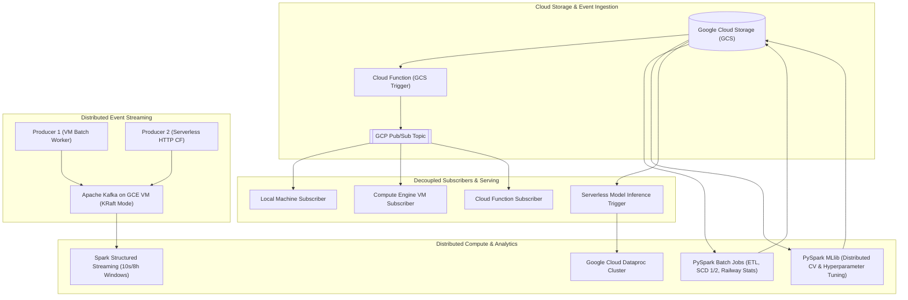

# Big Data Engineering Portfolio & Technical Report

---

## Executive Summary

This technical report provides a comprehensive architectural and algorithmic documentation of the distributed computing, real-time stream processing, batch ETL, and distributed machine learning systems developed throughout the Big Data engineering curriculum. 

The implementations leverage enterprise-grade cloud architectures across **Google Cloud Platform (GCP)** and the **Apache Big Data ecosystem**, utilizing **Apache Spark (PySpark Core, DataFrames, SparkSQL, Structured Streaming, and MLlib)**, **Apache Kafka (KRaft consensus mode)**, **Google Cloud Dataproc**, **Google Compute Engine (GCE)**, **Google Cloud Functions (2nd Gen Serverless)**, **Google Cloud Pub/Sub**, and **Google Cloud Storage (GCS)**.

This report serves as a detailed knowledge base and project portfolio suitable for building high-impact resume bullet points, preparing for technical interviews (Data Engineer, Big Data Engineer, Distributed Systems Engineer, MLOps Engineer), and demonstrating end-to-end data systems proficiency.

---

## Core Competencies & Technology Matrix

| Domain | Technologies & Frameworks | Key Concepts & Patterns |
| :--- | :--- | :--- |
| **Distributed Batch Processing** | Apache Spark 3.x, PySpark, SparkSQL, Google Cloud Dataproc | Catalyst Optimizer, Tungsten Engine, RDD vs DataFrame APIs, Partitioning (`coalesce` vs `repartition`), Broadcast variables, UDFs |
| **Real-Time Stream Processing** | Spark Structured Streaming, Apache Kafka 4.x (KRaft), GCP Pub/Sub | Micro-batching, Sliding & Tumbling Event-Time Windows, Watermarking, Late Data Handling, Carry-forward Imputation |
| **Distributed Message Queues** | Apache Kafka, GCP Pub/Sub | KRaft Controller Quorum, Multi-partition topics, Consumer groups, At-least-once delivery, Publisher/Subscriber fan-out |
| **Data Warehousing & Modeling** | SparkSQL, Parquet, CSV, GCS Data Lake | Slowly Changing Dimensions (SCD Type 1 & Type 2), Surrogate keys, Referential integrity validation, Deduplication |
| **Distributed Machine Learning** | PySpark MLlib, Google Cloud Functions | DecisionTreeClassifier, ParamGridBuilder, CrossValidator, MulticlassClassificationEvaluator, Model persistence & serving |
| **Cloud & Serverless Architecture**| GCP (Dataproc, Compute Engine, Cloud Functions, GCS, VPC) | Serverless event triggers, CloudEvent specifications, IAM & VPC intra-network routing, Automated job submission |
| **Systems & Development** | Python 3.10+, Bash, Linux/Debian, Git, Virtual Environments | Automated deployment scripting, Environment variable injection, Production logging |

---

## Detailed Project Modules & Architectural Deep Dives

---

### Module 1: Cloud Text Analytics & Compute Engine Automation (Week 2)
- **Directory**: `W2/`
- **Primary Script**: `longest_lines.py`
- **Architecture**: Google Compute Engine (Debian VM) + Google Cloud Storage SDK
- **Problem Statement**:
  Implement an automated cloud compute worker that streams arbitrary text payloads from a cloud storage bucket, computes the maximum character length line(s) with tie-breaking logic, and uploads formatted analytical outputs back to the cloud storage data lake.
- **Technical Highlights**:
  - Utilized streaming line-by-line file consumption with `tempfile.TemporaryDirectory` to prevent memory exhaustion on resource-constrained compute instances.
  - Implemented single-pass O(N) evaluation to collect all maximal-length lines and line indices simultaneously.
  - Built shell automation (`cmds.txt`) to configure virtual environments, install cloud storage drivers, and execute jobs with parameterized CLI flags.

---

### Module 2: Serverless Event-Driven Cloud Functions (Week 3)
- **Directory**: `W3/`
- **Primary Script**: `w3_longest_lines.py`
- **Architecture**: 2nd Generation Google Cloud Function + CloudEvent Trigger + Cloud Logging
- **Problem Statement**:
  Create an automated serverless microservice that triggers instantly upon any object creation event in Google Cloud Storage, processes text files dynamically, logs results, and writes structured outputs.
- **Technical Highlights**:
  - Implemented `@functions_framework.cloud_event` consuming GCS `finalize` triggers.
  - Engineered loop-prevention heuristics to detect output file suffixes (`_longest_lines.txt`) and ignore them immediately, preventing infinite trigger cycles and runaway cloud compute billing.
  - Integrated native `logging` with Google Cloud Logging for observability and operational auditing.

---

### Module 3: High-Throughput Clickstream Aggregation: RDD vs. DataFrame API (Week 4)
- **Directory**: `W4/`
- **Primary Notebooks**: `W4GA_RDD.ipynb`, `W4GA_DF.ipynb`
- **Architecture**: PySpark 3.x on Google Cloud Dataproc
- **Problem Statement**:
  Process user clickstream log data (`user_id,timestamp`) partitioned across time intervals (`0-6h`, `6-12h`, `12-18h`, `18-24h`), comparing execution performance, syntax expressiveness, and physical plans between low-level Resilient Distributed Datasets (RDDs) and high-level DataFrames.
- **Technical Deep-Dive**:
  - **RDD Implementation**:
    - Leveraged functional transformations: `.map()` for timestamp parsing and bin assignment, `.filter()` for corrupt record removal, and `.reduceByKey()` for distributed aggregation.
    - Used union with zero-count default bins to ensure all 4 temporal buckets exist in output.
    - Resulted in lower execution optimization due to opaque Python UDF bytecode preventing Spark's Catalyst engine from optimizing transformations.
  - **DataFrame Implementation**:
    - Employed native Spark SQL columnar functions: `to_timestamp`, `hour`, `when().otherwise()`, and `.groupBy().agg(count())`.
    - Spark Catalyst Optimizer performed projection pruning, predicate pushdown, and optimized physical execution via Project Tungsten's off-heap memory and whole-stage code generation.

---

### Module 4: Production ETL Pipeline, Data Quality, & Referential Integrity (Week 5)
- **Directory**: `W5/`
- **Primary Script**: `w5_script.py`
- **Architecture**: Distributed PySpark on GCP Dataproc + GCS Data Lake
- **Problem Statement**:
  Ingest messy customer profile and transaction datasets, execute strict schema and data quality validations, handle duplicate and malformed entries, enforce relational referential integrity, and generate multi-dimensional financial aggregates.
- **Technical Highlights**:
  - **Broadcast Variables**: Distributed a standard city dictionary (`CITY_MAP_STANDARD`) across cluster worker nodes using `sc.broadcast()` to eliminate cross-node network shuffle during city standardization.
  - **Window-Based Deterministic Deduplication**:
    - Assigned monotonic row identifiers (`F.monotonically_increasing_id()`).
    - Partitioned by all business columns using `Window.partitionBy(*cols).orderBy("_row_id_tmp")`.
    - Filtered `row_number() == 1` for clean records, isolating exact duplicates into an `invalid_customers` audit dataset.
  - **Referential Integrity Enforcement**:
    - Utilized `left_anti` and `left_semi` distributed joins to decouple transactions referencing nonexistent customers, ensuring zero dangling foreign keys in downstream tables without manual looping.
  - **Multi-Level Aggregations**:
    - Evaluated total/average transaction volume per customer, total spend per city, and top 3 high-value spenders via Spark DataFrame API, writing coalesced CSV partitions to GCS.

---

### Module 5: Slowly Changing Dimensions (SCD Type 1 & Type 2) in SparkSQL (Week 6)
- **Directory**: `W6/`
- **Primary Script**: `w6_script.py`
- **Architecture**: SparkSQL on Google Cloud Dataproc
- **Problem Statement**:
  Design and execute enterprise data warehouse dimension lifecycle pipelines to handle mutating customer attributes using pure SparkSQL: implementing both SCD Type 1 (in-place overwrite) and SCD Type 2 (full historical tracking with effective dates and current validity flags).
- **Technical Highlights**:
  - **SCD Type 1 (Current State Overwrite)**:
    - Filtered active master records (`current_flag = 1`).
    - Executed `FULL OUTER JOIN` between master and updates.
    - Used `COALESCE(u.attribute, m.attribute)` to overwrite stale data while inserting net-new customers.
  - **SCD Type 2 (Historical Versioning)**:
    - **Step 1 (Expired Records)**: Identified existing active records that received updates; marked `current_flag = 0` and set `expiry_date = change_date`.
    - **Step 2 (New Active Versions)**: Inserted updated values with `current_flag = 1`, `effective_date = change_date`, and `expiry_date = NULL`.
    - **Step 3 (Unaffected Records)**: Preserved unmutated records as-is.
    - **Step 4 (Unified Dimension)**: Combined all three subsets using `UNION ALL` to deliver a complete, queryable history of all dimension states.

---

### Module 6: Decoupled Multi-Subscriber Pub/Sub Architecture (Week 7)
- **Directory**: `W7/`
- **Scripts**: `publisher_function.py`, `subscriber_function.py`, `local_subscriber.py`, `vm_subscriber.py`, `vm_init.sh`
- **Architecture**: Google Cloud Storage + GCP Pub/Sub + Cloud Functions + Compute Engine + Local Client
- **Problem Statement**:
  Construct an enterprise event-driven messaging topology where a single file upload event is broadcast to multiple distributed, heterogeneous consumers operating across different execution environments (cloud function, remote cloud VM, local workstation).
- **Technical Highlights**:
  - **Event Ingestion**: GCS bucket upload triggers `publisher_function.py`, which packages file metadata (bucket, object name, timestamp, size) into JSON and publishes to a Pub/Sub topic.
  - **Heterogeneous Fan-Out**:
    - **Cloud Function Subscriber**: Serverless push consumer triggered on message delivery.
    - **Compute Engine VM Subscriber**: Long-running streaming pull consumer (`subscriber_client.subscribe(sub_path, callback)`) with graceful signal handling and message acknowledgment (`msg.ack()`).
    - **Local Machine Subscriber**: Remote secure pull subscriber executing outside GCP perimeter using client libraries and service authentication.
  - **Idempotency & Parallelism**: All subscribers independently process the target file from GCS, compute analytical results, and persist unique, environment-tagged outputs back to GCS without contention.

---

### Module 7: Real-Time Streaming Pipeline with Apache Kafka (KRaft) & Spark Structured Streaming (Week 8)
- **Directory**: `W8/`
- **Scripts**: `producer1_vm.py`, `producer2_cf.py`, `spark_consumer.py`, `trigger_cf.py`, shell setup scripts
- **Architecture**: Apache Kafka 4.x (KRaft mode on GCE VM) + Cloud Function + Spark Structured Streaming on Dataproc
- **Problem Statement**:
  Build an end-to-end, real-time distributed streaming pipeline: deploy a modern ZooKeeper-less Apache Kafka broker, ingest concurrent event streams from multiple decoupled producers (batch worker VM and serverless microservice), and perform sliding window aggregations in Spark Structured Streaming.
- **Technical Highlights**:
  - **Kafka in KRaft Mode**:
    - Deployed Apache Kafka utilizing the modern KRaft (Kafka Raft Metadata) consensus protocol on a dedicated GCE VM, removing ZooKeeper dependency.
    - Configured listeners for dual network interfaces: internal VPC IP (`PLAINTEXT://0.0.0.0:9092`) and external IP advertising for distributed connectivity.
  - **Multi-Source Concurrent Producers**:
    - **Producer 1 (GCE VM)**: Generates batches of 10 records every 10 seconds, streaming JSON payloads with keys and timestamps to the Kafka topic.
    - **Producer 2 (Cloud Function)**: Serverless microservice invoked via HTTP trigger (`trigger_cf.py`) emitting 5 records per invocation; maintains state tracking (`producer2_state.json` on GCS) for fault tolerance and resume capability.
  - **Spark Structured Streaming Engine**:
    - Subscribed to Kafka stream using `spark-sql-kafka-0-10`.
    - Implemented a 10-second sliding event-time window with a 5-second micro-batch trigger interval.
    - Configured watermarking (`withWatermark("timestamp", "10 seconds")`) to bound state memory in driver and handle out-of-order event streams.
    - Logged live window counts using `complete` output mode.

---

### Module 8: Distributed Machine Learning & Serverless MLOps Pipeline (Week 9)
- **Directory**: `W9/`
- **Scripts**: `train.py`, `predict.py`, `sample_mnist_test.py`, `gcf.py`
- **Architecture**: PySpark MLlib on Dataproc + GCS + Google Cloud Function Trigger
- **Problem Statement**:
  Build a scalable, distributed machine learning training and automated inference pipeline for high-dimensional classification (MNIST dataset in LibSVM format) using PySpark MLlib, cross-validation, hyperparameter tuning, model serialization, and event-driven inference triggers.
- **Technical Highlights**:
  - **Distributed Model Training**:
    - Ingested sparse multiclass features via `spark.read.format("libsvm")`.
    - Constructed an ML Pipeline combining `DecisionTreeClassifier` with `MulticlassClassificationEvaluator(metricName="accuracy")`.
    - Built a parameter search space via `ParamGridBuilder`: tuning `maxDepth` [5, 10, 15], `maxBins` [32, 64], and `minInstancesPerNode` [1, 2].
    - Executed 3-Fold Cross-Validation (`CrossValidator`) with worker-level parallelism (`parallelism=2`).
  - **Model Artifact Persistence**:
    - Extracted optimal hyperparameter configurations from the best pipeline model stage and exported to GCS as JSON metadata.
    - Serialized the complete fitted `PipelineModel` to GCS for reusable batch scoring.
  - **Event-Driven Automated Inference**:
    - Developed `gcf.py`: a Cloud Function triggered by test data uploads to GCS.
    - Dynamically provisions and submits a Dataproc PySpark batch inference job using the Google API Client Discovery library, scoring new data against the serialized model and storing predictions back to GCS.

---

### Module 9: Large-Scale Railway Transit Analytics & Exact Percentile Estimation (OPPE 1)
- **Directory**: `OPPE/`
- **Scripts**: `oppe1.py`, `gcf.py`
- **Architecture**: PySpark on Dataproc + Google Cloud Functions
- **Problem Statement**:
  Analyze massive Indian Railways schedule data to extract station-level operational metrics: calculate mean, standard deviation, and mathematically exact median, 95th, and 99th percentile train halt durations, followed by computing peak 1-hour sliding-window train congestion.
- **Technical Highlights**:
  - **Exact Percentile Estimation via Linear Interpolation**:
    - In standard Spark SQL, `approxPercentile` uses the t-digest algorithm, which introduces approximation error.
    - Implemented custom exact percentile logic: collected duration arrays per station, sorted them with `F.sort_array()`, and applied linear rank interpolation across floor and ceil indices using PySpark column expressions:
      $$\text{Interpolated Value} = (1 - f) \cdot V_{\lfloor pos \rfloor} + f \cdot V_{\lceil pos \rceil}$$
  - **Sliding-Window Congestion Analysis**:
    - Filtered events for the single busiest railway station by aggregate halt duration.
    - Defined an event-time sliding window: `Window.partitionBy("Station Name").orderBy(departure_seconds).rangeBetween(-3600, 0)`.
    - Computed the maximum concurrent train volume within any continuous 1-hour window across the entire dataset.
  - **Serverless Post-Processing Trigger**:
    - Built a Cloud Function (`gcf.py`) triggered by GCS CSV finalization to parse station statistics and identify the station with the highest 99th percentile stop duration.

---

### Module 10: Real-Time Air Quality Streaming Analytics with Imputation & Dynamic Ranking (OPPE 2)
- **Directory**: `OPPE2/`
- **Scripts**: `producer.py`, `consumer.py`, Kafka setup scripts
- **Architecture**: Apache Kafka + PySpark Structured Streaming on Dataproc + GCS Checkpointing
- **Problem Statement**:
  Process continuous global air quality telemetry: detect and impute temporal data gaps per city, stream clean data into Apache Kafka, and execute an 8-hour sliding window streaming aggregation that computes multi-pollutant severity scores and dynamically ranks cities in real time.
- **Technical Highlights**:
  - **Complex Time-Series Gap Detection & Imputation**:
    - Detected missing hourly observations per city using `F.lag()` over `Window.partitionBy("city").orderBy("event_hour")`.
    - Where temporal gaps exceeded 3600 seconds, generated synthetic timestamps using Spark's `sequence()` expression and flattened them via `F.explode_outer()`.
    - Applied **carry-forward imputation** (Last Observation Carried Forward - LOCF) for 13 sensor columns using `F.last(col, ignorenulls=True).over(carry_window)` over an unbounded preceding window.
  - **Real-Time Structured Streaming Engine**:
    - Consumed Kafka streams using PySpark Structured Streaming with a 1-hour watermark.
    - Converted pollutant units to standard parts-per-billion ($\text{ppb}$).
    - Aggregated data over an **8-hour sliding window with a 1-hour slide**:
      - $V_1 = \max(\text{AQI})$
      - $V_2 = \sum(\text{Pollutants in ppb})$
    - Applied `foreachBatch` to compute dense window rankings via `row_number().over(Window.partitionBy("window").orderBy(V1.asc(), V2.asc()))`.
    - Wrote structured, ranked results to GCS partitioned by batch ID with full checkpoint resilience.

---

## Resume Impact Statements (STAR Format)

Use these bullet points directly on your resume, LinkedIn profile, or portfolio to articulate the scope and technical depth of your experience:

### Big Data Engineer / Data Engineer
- **Architected and deployed an end-to-end real-time streaming pipeline** using Apache Kafka (KRaft mode) on Google Compute Engine and PySpark Structured Streaming on Dataproc, executing 10-second sliding-window aggregations across concurrent multi-source producers with fault-tolerant checkpointing.
- **Engineered an enterprise data quality and ETL framework in PySpark** processing millions of customer and transactional records, implementing window-based deterministic deduplication, broadcast variable lookups, and referential integrity validation using `left_anti` and `left_semi` joins.
- **Implemented Slowly Changing Dimensions (SCD Type 1 & Type 2)** using pure SparkSQL on Dataproc, enabling historical record versioning, automated expiry marking, and active validity flag updates across evolving dimensional datasets.
- **Designed a serverless, decoupled event-driven messaging architecture** using GCP Cloud Functions and Pub/Sub, fanning out cloud storage ingestion events across heterogeneous subscribers (Compute Engine VM, serverless Cloud Function, and local client) with automated error handling and idempotency.
- **Engineered a continuous time-series stream ingestion pipeline** for air quality telemetry, implementing sequence-based missing timestamp generation, Last Observation Carried Forward (LOCF) imputation, and 8-hour sliding window ranking via Spark Structured Streaming and Kafka.

### Distributed Systems & MLOps Engineer
- **Built a distributed machine learning pipeline on Google Cloud Dataproc** using PySpark MLlib, training Decision Tree classifiers on high-dimensional sparse LibSVM datasets with 3-fold cross-validation and hyperparameter grid search across worker nodes.
- **Automated model lifecycle and inference orchestration** by serializing trained PySpark ML models to Google Cloud Storage and provisioning serverless Cloud Functions to trigger Dataproc batch inference jobs upon test data arrival.
- **Developed custom mathematical interpolation algorithms in PySpark** to compute exact percentiles (p50, p95, p99) and sliding event-time window congestion metrics over large-scale transit datasets, eliminating approximation errors inherent in traditional hashing methods.

---

## Technical Skills Summary

- **Distributed Compute**: Apache Spark (Core RDD, DataFrame API, SparkSQL, Structured Streaming), PySpark MLlib, Hadoop MapReduce principles.
- **Messaging & Streaming**: Apache Kafka (KRaft architecture, multi-partition topics, consumer offsets), Google Cloud Pub/Sub.
- **Cloud Infrastructure (GCP)**: Dataproc (managed Hadoop/Spark), Compute Engine (Linux VMs, systemd/daemon services, networking), Cloud Functions (2nd Gen, CloudEvents), Cloud Storage (GCS data lake), Cloud Logging.
- **Data Modeling & Architecture**: Slowly Changing Dimensions (Type 1 & 2), Event-driven Architecture, Data Lakehouse, Windowed Stream Analytics, Watermarking, Time-series Imputation.
- **Programming & Tools**: Python, SQL, Bash scripting, Linux CLI, Git, JSON, CSV, LibSVM, Parquet.
